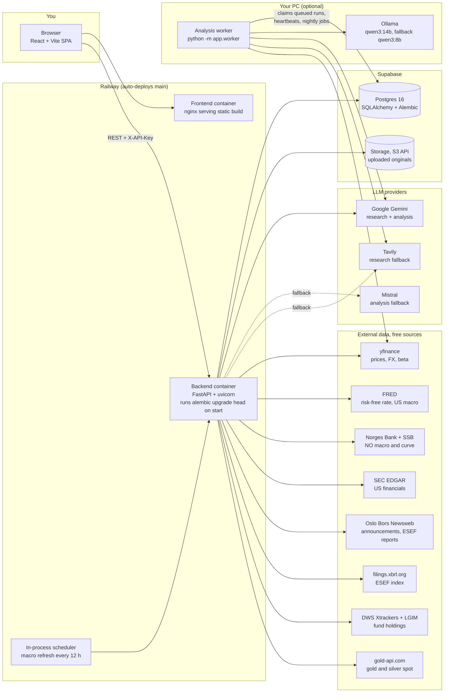
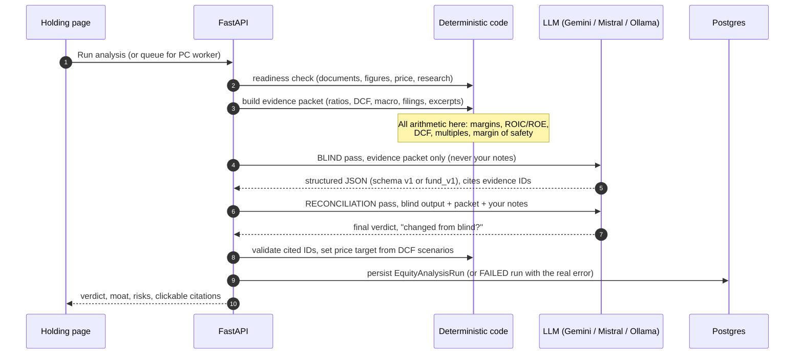

# Aladdin: architecture

*Written 2026-09-30 from the code on `main` (`b8e8f79`). Update it in the same change whenever a
service, provider, scheduled job or deployment piece is added or removed.*

Aladdin is a personal, single-user equity analysis app in the Buffett/Munger style. **Deterministic
Python code computes every number; an LLM only researches and writes judgement, and every claim it
makes must cite an evidence ID.** The five non-negotiable rules are in [`CLAUDE.md`](../CLAUDE.md).

Contents: [1 System diagram](#1-system-diagram) · [2 Analysis run](#2-one-analysis-run-end-to-end) ·
[3 Backend layers](#3-backend-layers) · [4 Deployment](#4-deployment-and-runtime) ·
[5 Background jobs](#5-background-jobs) · [6 Data model](#6-data-model) ·
[7 Where each rule is enforced](#7-where-each-guardrail-is-enforced) · [8 Frontend](#8-frontend) ·
[9 CI and tooling](#9-ci-and-tooling)

---

## 1. System diagram



The PC worker talks **only to the database and outbound APIs**. It opens no port and accepts no
input (CLAUDE.md rule 5). Railway cannot reach Ollama, so an analysis started from the Railway site
either runs on Gemini/Mistral, or is queued for the worker ("Run on my PC").

---

## 2. One analysis run, end to end



Failure handling: a blind-pass failure stores a FAILED run with the real error; a reconciliation
failure keeps the blind output and records the second error separately. Prompts
(`backend/prompts/analysis/{blind,reconciliation}_v2.md`, `*_fund_v1.md`) and schemas
(`app/domain/analysis_schema/`) are versioned files; a change that could alter a real output is a
new version file.

---

## 3. Backend layers

```
backend/app/
  main.py        FastAPI app, middleware, router registration, lifespan (starts the macro scheduler)
  security.py    ApiKeyMiddleware: X-API-Key must equal APP_AUTH_TOKEN (only /health is exempt)
  timing.py      Server-Timing / X-DB-Queries headers on every response
  api/           20 routers, thin: validate, call a service, shape the response
  services/      business logic (the only place that orchestrates providers + DB)
  providers/     adapters for every outside system, behind interfaces in providers/base.py
  domain/        pure, versioned definitions: schemas, assumptions, series catalogue, sectors
  models/        SQLAlchemy tables
  schemas/       Pydantic request/response models
  worker/        the PC worker loop
  config/        Settings (env-driven), database session
```

### API routers

| Router | Serves |
|---|---|
| `holdings`, `accounts`, `portfolio` | Positions, CSV import, portfolio overview, deletes (need `confirm`) |
| `documents`, `sources` | Uploads, stored-file streaming (`/documents/{id}/file`), anchored reader, SEC EDGAR and Newsweb fetches |
| `research` | Macro, sector and company research (cached 24 h, served stale rather than blocking) |
| `valuation` | DCF, reverse DCF, multiples, Margin-of-safety board, board refresh |
| `analysis` | Readiness, run, queue, latest run, notes |
| `thesis` | Tripwires, "what changed", verdict timeline, nightly check |
| `risk`, `performance` | Correlation, clusters, stress, regime; value history, benchmark, real return |
| `funds` | Fund facts, look-through holdings (Xtrackers, L&G), constituent multiples |
| `macro`, `precious_metals`, `watchlist`, `journal` | Macro series; physical coins; buy-below list; decision journal |
| `system`, `usage`, `settings` | Status page, LLM usage ledger, demo-mode toggle |
| `game` | Read-only `GET /game/state` (Fortress) and `GET /game/siege` (Siege Simulator). The Fortress pages write only through existing endpoints (account cash, watchlist buy-below and refresh, queue analyses) |

### Services (by area)

| Area | What it does |
|---|---|
| `calculations`, `metrics`, `valuation/` | Ratios, owner earnings, ROIC/ROE, DCF with growth cap and fade, bank price-to-book path, plausibility guard, discount rate, regime adjustment (off by default) |
| `documents/`, `filings/` | Ingestion (ESEF inline XBRL, PDF text, Excel, CSV), section-aware chunking, anchoring figures to exact numbers, SEC EDGAR, Newsweb, ESEF index |
| `analysis/` | Readiness, evidence packet, blind and reconciliation passes, queue, pipeline |
| `research/`, `macro/`, `market_data/` | Research with cache, macro series and refresh, price / FX / beta / shares / risk-free rate |
| `risk/`, `performance/`, `thesis/` | Correlation, stress, regime; portfolio history; tripwires and nightly check |
| `funds/`, `precious_metals/`, `portfolio_import/` | Fund facts and look-through valuation; coins at spot; broker CSV |
| `snapshots`, `snapshot_refresh` | Stored page snapshots so slow pages load from the database |
| `llm_ledger`, `system_status`, `settings/` | LLM usage ledger and daily budget, status page, demo mode guard |
| `game/` | Fortress state, temperament, hand-written advisor lines, Siege Simulator. Code only, no LLM or market call; see [game-mode-fortress](game-mode-fortress-2026-10-01.md) |
| `warmup` | Worker warm-up of cold holdings and the keep-warm job (PC worker loop, `worker/runner.py`) |

### Providers

| Purpose | Options (setting) | Notes |
|---|---|---|
| Analysis LLM | `google_ai_studio` (default), `mistral`, `ollama` (`LLM_PROVIDER`, `LLM_FALLBACK_PROVIDER`) | Gemini daily budget is counted from the DB ledger, so it survives restarts and is shared with the worker |
| Research | `gemini_search` with optional `tavily` fallback (`RESEARCH_FALLBACK_PROVIDER`) | Always wrapped in `CompositeResearchProvider` |
| Market data | `yfinance` | Unofficial; NaN closes are handled |
| Rates and macro | FRED, Norges Bank, SSB | Series catalogue is versioned (`v2`) |
| Filings | SEC EDGAR, Newsweb, filings.xbrl.org | Newsweb is an undocumented endpoint |
| Fund holdings | DWS Xtrackers JSON feed, LGIM public CSV | Free, no login |
| Object storage | local disk (dev), S3-compatible (Supabase / R2) | `OBJECT_STORAGE_PROVIDER` |

---

## 4. Deployment and runtime

| Piece | Where | How it runs |
|---|---|---|
| Frontend | Railway service | `frontend/Dockerfile`: Vite build baked with `VITE_API_BASE_URL` and `VITE_API_KEY`, served by nginx (gzip, 1-year immutable cache on `/assets/`) |
| Backend | Railway service | `backend/Dockerfile` (Python 3.12), entrypoint runs `alembic upgrade head` then uvicorn, so every deploy migrates |
| Database | Supabase Postgres | Not reset by the rebuild; legacy non-equity tables are left alone on purpose |
| File storage | Supabase Storage (S3 API) | Original uploads |
| Local LLM worker | Your PC | `python -m app.worker` (or `backend/scripts/start-worker.ps1`); Ollama on the GPU |
| Local dev database | `docker/docker-compose.yml` | Postgres 16 only |
| Deploys | Railway watches `main` | A merge to `main` is a production deploy |

Backend env vars that matter most: `DATABASE_URL`, `APP_AUTH_TOKEN` (must equal the frontend's
`VITE_API_KEY`), `CORS_ALLOWED_ORIGINS`, `GOOGLE_AI_STUDIO_API_KEY`, `FRED_API_KEY`, `TAVILY_API_KEY`,
`OBJECT_STORAGE_*`. The full list with defaults is `backend/app/config/settings.py`.

The API-key gate is **not real access control**: the key ships in the frontend bundle. It keeps
bots and scanners off a public URL that serves real financial data.

---

## 5. Background jobs

| Job | Runs in | When | What |
|---|---|---|---|
| Macro refresh | Backend process (`MacroRefreshScheduler`) | Every 12 h (`MACRO_REFRESH_INTERVAL_HOURS`) | Norges Bank, SSB, FRED series |
| Analysis queue | PC worker | Polls every 30 s | Claims the oldest queued run, waits if the Gemini budget is spent and no research fallback exists, heartbeats, releases stale leases (30 min, 2 attempts) |
| Nightly tripwire check | PC worker | Once per UTC day after 03:00 | Refreshes prices for tripwire holdings, fires or clears tripwires, stores the result |
| Snapshot refresh | PC worker | Once per UTC day after 04:00 | Rebuilds Margin-of-safety, Watchlist, Risk and Performance snapshots |

If the PC worker is off, none of the three worker jobs run; the pages then show the last stored
snapshot with a Refresh button.

---

## 6. Data model

Alembic has one head (`q1c8d9e0f1a2`). Tables by group:

| Group | Tables |
|---|---|
| Portfolio | `accounts`, `holdings`, `portfolio_snapshots`, `portfolio_positions`, `precious_metal_holdings` |
| Documents and figures | `documents`, `document_pages`, `document_chunks`, `financial_line_items` |
| Funds | `fund_profiles`, `fund_return_periods`, `fund_exposures`, `fund_constituent_multiples` |
| Analysis | `equity_analysis_runs`, `equity_holding_notes`, `analysis_worker_heartbeats`, `llm_usage_events` |
| Research and market data | `research_runs`, `research_items`, `market_observations`, `fx_observations`, `share_count_observations`, `risk_free_rate_observations`, `price_history_observations`, `macro_observations`, `macro_series_status` |
| Thesis, risk, watchlist | `thesis_tripwires`, `portfolio_risk_snapshots`, `watchlist_items`, `decision_journal_entries` |
| Speed and settings | `computed_snapshots`, `app_settings` |
| Legacy (pre-rebuild, never queried; all rows removed by the 2026-09-21 wipe migration `e5f6a7b8c9d0`, tables kept) | `analysis_runs`, `holding_analyses`, `factor_assessments`, `evidence_references` |

---

## 7. Where each guardrail is enforced

| Rule (CLAUDE.md) | Enforced by |
|---|---|
| 1. All arithmetic is code | `services/calculations.py`, `metrics.py`, `valuation/`, `Decimal` throughout; price target set in `analysis/pipeline.py` from DCF scenarios |
| 2. Evidence-first | Evidence packet with IDs; cited IDs validated after each pass; unknown ID becomes a warning on the run |
| 3. Versioned prompts and schemas | `backend/prompts/`, `domain/analysis_schema/`, `domain/valuation_assumptions/`, macro catalogue; `ACTIVE_*_VERSION` settings |
| 4. Blind pass never sees notes | `run_blind_pass` takes no notes argument; only reconciliation receives them |
| 5. Documents are untrusted data | Evidence framed as data; the LLM only returns a record, nothing executes from it |
| Demo mode | `require_not_demo(db)` on every write; fabricated data on reads |
| Destructive endpoints | Require explicit `confirm` |

---

## 8. Frontend

React 18 + TypeScript, Vite, Tailwind, Recharts, React Router. Pages are lazy-loaded per route
(`src/App.tsx`).

| Area | Pages |
|---|---|
| Overview | Dashboard, Holdings, Holding detail, Portfolio |
| Judgement | Margin of safety, Watchlist, Thesis monitor, Journal, Analysis queue |
| Risk and returns | Portfolio risk, Performance, Precious metals |
| Context | Macro, Sector |
| Operations | System status, Settings |
| Game mode | Fortress (`/fortress`), Siege Simulator (`/fortress/siege`), Marketplace and per-holding Market store (`/fortress/marketplace`) |

Shared pieces: `src/lib/api.ts` (typed client, sends `X-API-Key`), `components/DocumentReader.tsx`
and `StatementsPane.tsx` (split-view reader), `InfoTooltip` + `lib/glossary.ts` (plain-language
explanations), `CommandPalette` (Ctrl+K). Tests: Vitest for `src/lib`, Playwright smoke in `e2e/`.

---

## 9. CI and tooling

| Check | Where | Notes |
|---|---|---|
| Ruff (pinned 0.16.8) + pytest | `ci.yml` backend job | Pytest uses in-memory SQLite and fakes for every provider: no network, no keys |
| Migrations up / down / up | `ci.yml` on Postgres 16 | Also checks for exactly one head |
| tsc, eslint, vitest, build | `ci.yml` frontend job | |
| gitleaks over full history | `ci.yml`, config `.gitleaks.toml` | Allowlists known false positives |
| Dependency audit | `ci.yml` | `pip-audit` and `npm audit --audit-level=high`; report-only for now |
| Post-deploy smoke test | `smoke.yml` | Read-only Playwright against the live site; needs repository variables `SMOKE_FRONTEND_URL` and `SMOKE_API_URL` |
| pre-commit | `.pre-commit-config.yaml` | Same ruff + gitleaks; blocks `.env` and document uploads outside `docs/` |

Every change goes through a feature branch and a pull request into `main` (see CLAUDE.md, "Pull
requests").
